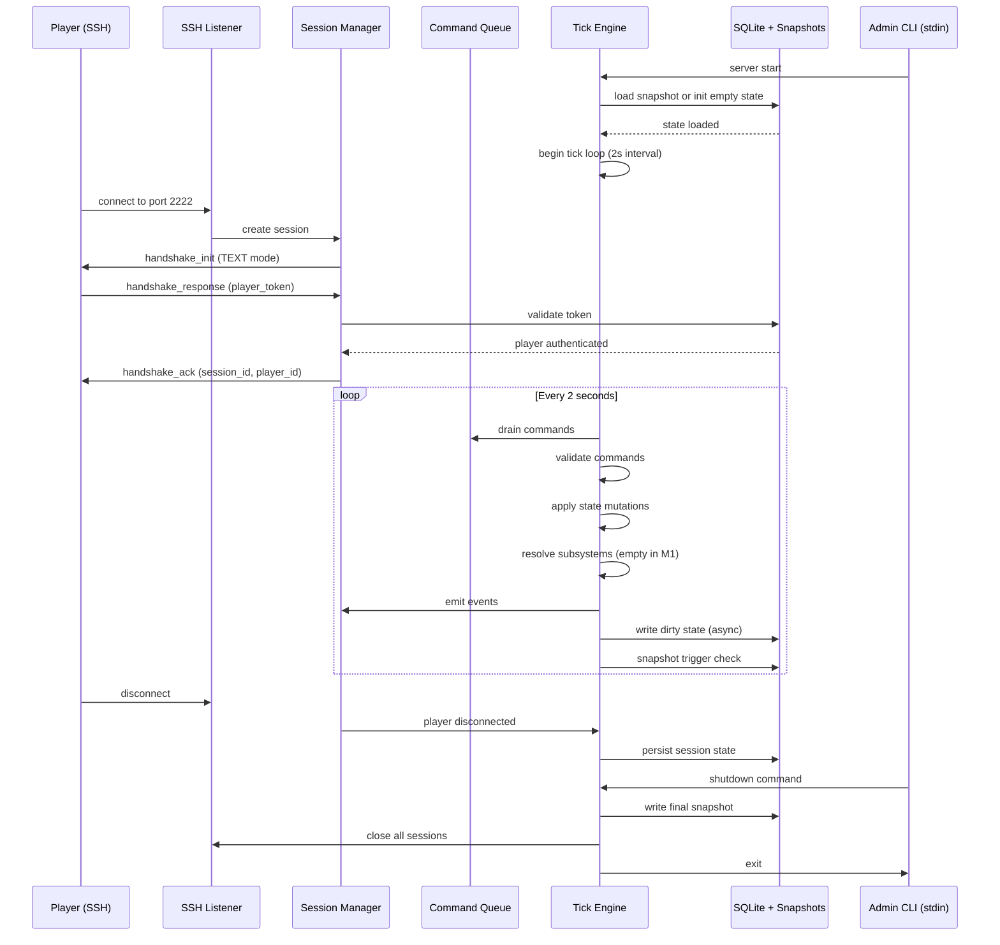

# Design Document: Milestone 1 Foundation

## Overview

Milestone 1 establishes the core server infrastructure for BlackSector — a multiplayer text-based space trading game served over SSH. This milestone delivers a running headless server that accepts SSH connections, manages sessions, runs the tick loop, persists state to SQLite, and provides admin controls via stdin. No game features (trading, combat, mining) are implemented yet; the focus is on the foundation that all future features will build upon.

Success criteria: A player can SSH in, complete the handshake, receive a `handshake_ack`, and the server survives restart by restoring state from snapshot.

## Main Algorithm/Workflow



## Core Interfaces/Types

### Configuration

```go
// Config represents server.json structure
type Config struct {
    Server   ServerConfig   `json:"server"`
    Logging  LoggingConfig  `json:"logging"`
    Universe UniverseConfig `json:"universe"`
}

type ServerConfig struct {
    SSHPort               int    `json:"ssh_port"`
    TickIntervalMs        int    `json:"tick_interval_ms"`
    SnapshotIntervalTicks int    `json:"snapshot_interval_ticks"`
    MaxConcurrentPlayers  int    `json:"max_concurrent_players"`
    DBPath                string `json:"db_path"`
    WorldConfigPath       string `json:"world_config_path"`
}

type LoggingConfig struct {
    Level       string `json:"level"`
    LogFile     string `json:"log_file"`
    DebugEnabled bool  `json:"debug_log_enabled"`
}

type UniverseConfig struct {
    UniverseSeed int64 `json:"universe_seed"`
}
```

### Session Management

```go
// Session represents an active player connection
type Session struct {
    SessionID      string
    PlayerID       string
    InterfaceMode  string // "TEXT" or "GUI"
    State          SessionState
    ConnectedAt    int64
    DisconnectedAt *int64
    LingerExpiryAt *int64
    LastActivityAt int64
}

type SessionState string

const (
    SessionConnected            SessionState = "CONNECTED"
    SessionDisconnectedLingering SessionState = "DISCONNECTED_LINGERING"
    SessionDockedOffline        SessionState = "DOCKED_OFFLINE"
    SessionTerminated           SessionState = "TERMINATED"
)
```

### Tick Engine

```go
// TickEngine is the authoritative simulation loop
type TickEngine struct {
    tickNumber    int64
    tickInterval  time.Duration
    running       bool
    commandQueue  chan Command
    shutdownChan  chan struct{}
    db            *Database
    sessionMgr    *SessionManager
    logger        zerolog.Logger
}

// Command represents a player action to be processed
type Command struct {
    SessionID   string
    PlayerID    string
    CommandType string
    Payload     json.RawMessage
    EnqueuedAt  int64
}
```

### Database Layer

```go
// Database wraps SQLite connection with WAL mode
type Database struct {
    conn   *sql.DB
    logger zerolog.Logger
}

// Player represents a registered player account
type Player struct {
    PlayerID    string
    PlayerName  string
    TokenHash   string
    Credits     int64
    CreatedAt   int64
    LastLoginAt *int64
    IsBanned    bool
}
```

### Protocol Messages

```go
// HandshakeInit is sent by server after SSH auth
type HandshakeInit struct {
    Type            string `json:"type"` // "handshake_init"
    Timestamp       int64  `json:"timestamp"`
    ProtocolVersion string `json:"protocol_version"`
    InterfaceMode   string `json:"interface_mode"`
    ServerName      string `json:"server_name"`
    MOTD            string `json:"motd"`
    Payload         struct{} `json:"payload"`
}

// HandshakeResponse is sent by client
type HandshakeResponse struct {
    Type            string `json:"type"` // "handshake_response"
    Timestamp       int64  `json:"timestamp"`
    ProtocolVersion string `json:"protocol_version"`
    CorrelationID   string `json:"correlation_id"`
    Payload         struct {
        PlayerToken string `json:"player_token"`
    } `json:"payload"`
}

// HandshakeAck is sent by server on success
type HandshakeAck struct {
    Type          string `json:"type"` // "handshake_ack"
    Timestamp     int64  `json:"timestamp"`
    CorrelationID string `json:"correlation_id"`
    Payload       struct {
        SessionID      string `json:"session_id"`
        PlayerID       string `json:"player_id"`
        TickIntervalMs int    `json:"tick_interval_ms"`
        InterfaceMode  string `json:"interface_mode"`
    } `json:"payload"`
}

// HandshakeReject is sent on authentication failure
type HandshakeReject struct {
    Type          string `json:"type"` // "handshake_reject"
    Timestamp     int64  `json:"timestamp"`
    CorrelationID string `json:"correlation_id"`
    Payload       struct {
        Reason string `json:"reason"`
    } `json:"payload"`
}
```

### Snapshot Format

```go
// Snapshot represents full server state at a tick
type Snapshot struct {
    SnapshotVersion string `json:"snapshot_version"`
    Tick            int64  `json:"tick"`
    Timestamp       int64  `json:"timestamp"`
    ServerName      string `json:"server_name"`
    ProtocolVersion string `json:"protocol_version"`
    State           SnapshotState `json:"state"`
}

type SnapshotState struct {
    Players  []Player  `json:"players"`
    Sessions []Session `json:"sessions"`
    // Ships, traders, etc. added in future milestones
}
```

## Key Functions with Formal Specifications

### Function 1: LoadConfig()

```go
func LoadConfig(path string) (*Config, error)
```

**Preconditions:**
- `path` is a valid file path string
- File at `path` exists and is readable
- File contains valid JSON matching Config schema

**Postconditions:**
- Returns non-nil `*Config` with all required fields populated
- Returns error if file missing, unreadable, or invalid JSON
- Config values are validated (e.g., `tick_interval_ms > 0`)

**Loop Invariants:** N/A (no loops)

### Function 2: InitDatabase()

```go
func InitDatabase(dbPath string, logger zerolog.Logger) (*Database, error)
```

**Preconditions:**
- `dbPath` is a valid file path string
- SQLite library is available
- File system is writable at `dbPath` location

**Postconditions:**
- Returns `*Database` with open connection in WAL mode
- All required PRAGMAs applied: `journal_mode=WAL`, `synchronous=NORMAL`, `foreign_keys=ON`, `busy_timeout=5000`
- Database schema initialized if file is new
- Returns error if connection fails or PRAGMAs fail

**Loop Invariants:** N/A

### Function 3: RunTickLoop()

```go
func (te *TickEngine) RunTickLoop()
```

**Preconditions:**
- `te.running == true`
- Database connection is open
- Session manager is initialized
- `te.tickInterval > 0`

**Postconditions:**
- Tick loop runs until `te.running == false`
- Each tick increments `te.tickNumber`
- Each tick completes within `te.tickInterval` or logs warning
- Snapshot written every `SnapshotIntervalTicks`

**Loop Invariants:**
- `te.tickNumber` increases monotonically
- Tick duration is measured and logged if > 500ms
- Command queue is drained at start of each tick
- No tick is skipped or executed in parallel

### Function 4: HandleHandshake()

```go
func (sm *SessionManager) HandleHandshake(conn net.Conn, req HandshakeResponse) error
```

**Preconditions:**
- `conn` is an open SSH connection
- `req.Payload.PlayerToken` is non-empty
- `req.ProtocolVersion` is provided

**Postconditions:**
- If token valid: sends `HandshakeAck`, creates session, returns nil
- If token invalid: sends `HandshakeReject`, closes connection, returns error
- If session conflict: sends `HandshakeReject` with reason `session_already_active`
- Session state is persisted to database

**Loop Invariants:** N/A

### Function 5: SaveSnapshot()

```go
func SaveSnapshot(state *Snapshot, dir string) error
```

**Preconditions:**
- `state` is non-nil and contains valid data
- `dir` is a writable directory path
- `state.Tick >= 0`

**Postconditions:**
- Snapshot written to `{dir}/snapshot_{tick}_{timestamp}.json`
- File written atomically (temp file + rename)
- `snapshot_latest.json` symlink updated
- Old snapshots beyond retention count deleted
- Returns error if write fails

**Loop Invariants:** N/A

### Function 6: LoadSnapshot()

```go
func LoadSnapshot(dir string) (*Snapshot, error)
```

**Preconditions:**
- `dir` is a readable directory path
- Directory may or may not contain snapshots

**Postconditions:**
- If snapshot exists: returns most recent valid snapshot
- If no snapshot: returns nil, nil (not an error)
- If snapshot invalid: returns nil, error
- Validates `snapshot_version` and `protocol_version`

**Loop Invariants:** N/A

## Algorithmic Pseudocode

### Main Server Startup

```pascal
ALGORITHM ServerStartup(configPath)
INPUT: configPath (string)
OUTPUT: running server or exit with error

BEGIN
  // Step 1: Load configuration
  config ← LoadConfig(configPath)
  IF config = NULL THEN
    LOG "Failed to load config"
    EXIT 1
  END IF
  
  // Step 2: Initialize logger
  logger ← InitLogger(config.Logging)
  LOG "Server starting" AT INFO
  
  // Step 3: Open database
  db ← InitDatabase(config.Server.DBPath, logger)
  IF db = NULL THEN
    LOG "Failed to open database"
    EXIT 1
  END IF
  
  // Step 4: Load or initialize world state
  snapshot ← LoadSnapshot("snapshots/")
  IF snapshot ≠ NULL THEN
    state ← RestoreFromSnapshot(snapshot)
    tickNumber ← snapshot.Tick + 1
    LOG "Restored from snapshot at tick" + tickNumber
  ELSE
    state ← InitializeEmptyState()
    tickNumber ← 0
    LOG "Starting with empty state"
  END IF
  
  // Step 5: Initialize tick engine
  tickEngine ← NewTickEngine(config, db, logger, tickNumber)
  
  // Step 6: Initialize session manager
  sessionMgr ← NewSessionManager(db, logger)
  
  // Step 7: Start admin CLI
  GO AdminCLI(tickEngine, logger)
  
  // Step 8: Start SSH listener
  sshListener ← StartSSHListener(config.Server.SSHPort, sessionMgr)
  IF sshListener = NULL THEN
    LOG "Failed to bind SSH port"
    EXIT 1
  END IF
  LOG "SSH listener on port" + config.Server.SSHPort
  
  // Step 9: Begin tick loop
  LOG "Tick loop starting"
  tickEngine.RunTickLoop()
  
  // Unreachable until shutdown
END
```

### Tick Loop Execution

```pascal
ALGORITHM RunTickLoop(tickEngine)
INPUT: tickEngine (initialized TickEngine)
OUTPUT: runs until shutdown signal

BEGIN
  WHILE tickEngine.running = TRUE DO
    tickStart ← CurrentTimeMs()
    
    // Phase 1: Drain command queue
    commands ← DrainCommandQueue(tickEngine.commandQueue)
    
    // Phase 2: Validate commands
    validCommands ← []
    FOR EACH cmd IN commands DO
      IF ValidateCommand(cmd) = TRUE THEN
        validCommands.APPEND(cmd)
      ELSE
        EmitCommandReject(cmd)
      END IF
    END FOR
    
    // Phase 3: Apply state mutations (empty in M1)
    FOR EACH cmd IN validCommands DO
      // No-op in Milestone 1 - no game commands yet
      LOG "Command received but not processed (M1)" AT DEBUG
    END FOR
    
    // Phase 4: Resolve subsystems (empty in M1)
    // Navigation, combat, economy, etc. - all no-ops
    
    // Phase 5: Emit events to sessions
    FOR EACH session IN tickEngine.sessionMgr.ActiveSessions() DO
      FlushEventsToSession(session)
    END FOR
    
    // Phase 6: Persist dirty state (async)
    GO PersistDirtyRecords(tickEngine.db)
    
    // Phase 7: Snapshot trigger check
    IF tickEngine.tickNumber MOD tickEngine.snapshotInterval = 0 THEN
      snapshot ← CreateSnapshot(tickEngine.state, tickEngine.tickNumber)
      GO SaveSnapshot(snapshot, "snapshots/")
      LOG "Snapshot triggered at tick" + tickEngine.tickNumber
    END IF
    
    // Phase 8: Tick end and sleep
    tickDuration ← CurrentTimeMs() - tickStart
    IF tickDuration > 500 THEN
      LOG "Slow tick: " + tickDuration + "ms" AT WARN
    END IF
    
    sleepDuration ← MAX(0, tickEngine.tickInterval - tickDuration)
    SLEEP sleepDuration
    
    tickEngine.tickNumber ← tickEngine.tickNumber + 1
  END WHILE
  
  LOG "Tick loop stopped"
END
```

### Handshake Protocol

```pascal
ALGORITHM HandleHandshake(conn, sessionMgr)
INPUT: conn (SSH connection), sessionMgr (SessionManager)
OUTPUT: authenticated session or connection closed

BEGIN
  // Step 1: Send handshake_init
  initMsg ← HandshakeInit{
    type: "handshake_init",
    timestamp: CurrentUnixTime(),
    protocol_version: "1.0",
    interface_mode: "TEXT",
    server_name: "Black Sector",
    motd: "Welcome. Watch your back out there."
  }
  SEND initMsg TO conn
  
  // Step 2: Wait for handshake_response (with timeout)
  response ← RECEIVE FROM conn WITH TIMEOUT 30 seconds
  IF response = TIMEOUT THEN
    rejectMsg ← HandshakeReject{
      reason: "handshake_timeout"
    }
    SEND rejectMsg TO conn
    CLOSE conn
    RETURN ERROR
  END IF
  
  // Step 3: Validate protocol version
  IF response.protocol_version ≠ "1.0" THEN
    rejectMsg ← HandshakeReject{
      reason: "version_mismatch"
    }
    SEND rejectMsg TO conn
    CLOSE conn
    RETURN ERROR
  END IF
  
  // Step 4: Authenticate player token
  player ← sessionMgr.db.GetPlayerByToken(response.payload.player_token)
  IF player = NULL THEN
    rejectMsg ← HandshakeReject{
      reason: "invalid_token"
    }
    SEND rejectMsg TO conn
    CLOSE conn
    RETURN ERROR
  END IF
  
  // Step 5: Check for existing session
  existingSession ← sessionMgr.GetActiveSession(player.PlayerID)
  IF existingSession ≠ NULL THEN
    rejectMsg ← HandshakeReject{
      reason: "session_already_active"
    }
    SEND rejectMsg TO conn
    CLOSE conn
    RETURN ERROR
  END IF
  
  // Step 6: Create session
  session ← Session{
    session_id: GenerateUUID(),
    player_id: player.PlayerID,
    interface_mode: "TEXT",
    state: "CONNECTED",
    connected_at: CurrentUnixTime(),
    last_activity_at: CurrentUnixTime()
  }
  sessionMgr.AddSession(session)
  sessionMgr.db.InsertSession(session)
  
  // Step 7: Send handshake_ack
  ackMsg ← HandshakeAck{
    type: "handshake_ack",
    timestamp: CurrentUnixTime(),
    correlation_id: response.correlation_id,
    payload: {
      session_id: session.session_id,
      player_id: player.PlayerID,
      tick_interval_ms: 2000,
      interface_mode: "TEXT"
    }
  }
  SEND ackMsg TO conn
  
  LOG "Player" + player.PlayerName + "authenticated, session" + session.session_id
  RETURN SUCCESS
END
```

### Graceful Shutdown

```pascal
ALGORITHM GracefulShutdown(tickEngine, sessionMgr)
INPUT: tickEngine, sessionMgr
OUTPUT: clean server exit

BEGIN
  LOG "Shutdown initiated" AT INFO
  
  // Step 1: Stop accepting new connections
  tickEngine.running ← FALSE
  
  // Step 2: Send shutdown message to all sessions
  FOR EACH session IN sessionMgr.ActiveSessions() DO
    shutdownMsg ← {
      type: "server_shutdown",
      timestamp: CurrentUnixTime(),
      payload: {
        message: "Server is shutting down"
      }
    }
    SEND shutdownMsg TO session.conn
  END FOR
  
  // Step 3: Wait for current tick to complete
  WAIT UNTIL tickEngine.currentTickComplete = TRUE
  
  // Step 4: Write final snapshot
  snapshot ← CreateSnapshot(tickEngine.state, tickEngine.tickNumber)
  SaveSnapshot(snapshot, "snapshots/")
  LOG "Final snapshot saved at tick" + tickEngine.tickNumber
  
  // Step 5: Close all sessions
  FOR EACH session IN sessionMgr.AllSessions() DO
    CLOSE session.conn
    sessionMgr.db.UpdateSession(session.session_id, state: "TERMINATED")
  END FOR
  
  // Step 6: Close database
  tickEngine.db.Close()
  LOG "Database closed"
  
  // Step 7: Exit
  LOG "Server stopped" AT INFO
  EXIT 0
END
```

## Example Usage

### Starting the Server

```bash
# Compile the server
go build -o blacksector-server cmd/server/main.go

# Run with default config
./blacksector-server

# Run with custom config
./blacksector-server --config=/path/to/server.json
```

### Player Connection Flow

```bash
# Player connects via SSH
ssh -p 2222 player@localhost

# Server sends handshake_init (JSON over SSH)
# Player client sends handshake_response with token
# Server validates and sends handshake_ack
# Session is now active
```

### Admin Commands (stdin)

```bash
# Check server status
status

# List active sessions
sessions

# Shutdown server
shutdown
```

### Snapshot Recovery

```bash
# Server starts and finds snapshot
# Logs: "Restored from snapshot at tick 4821"
# Tick loop resumes from tick 4822
```

## Correctness Properties

*A property is a characteristic or behavior that should hold true across all valid executions of a system—essentially, a formal statement about what the system should do. Properties serve as the bridge between human-readable specifications and machine-verifiable correctness guarantees.*

### Property 1: Configuration Validation Completeness

*For any* configuration object loaded from server.json, all required fields must be present and all numeric values must be within valid ranges (tick_interval_ms > 0, ssh_port in 1024-65535, max_concurrent_players > 0, snapshot_interval_ticks > 0).

**Validates: Requirements 1.3, 1.4, 1.5, 1.6, 20.1, 20.2, 20.3, 20.4, 20.5, 20.6**

### Property 2: Database WAL Mode Invariant

*For any* database connection that is successfully opened, the journal_mode PRAGMA must be set to WAL, synchronous to NORMAL, foreign_keys to ON, and busy_timeout to 5000.

**Validates: Requirements 2.3, 2.4, 2.5, 2.6**

### Property 3: Snapshot Round-Trip Preservation

*For any* valid game state, creating a snapshot then loading it must restore the exact tick number (original + 1), all player data, and all session data without loss or corruption.

**Validates: Requirements 3.2, 3.3, 3.4, 3.5, 10.2, 10.3, 10.4**

### Property 4: Session Creation Uniqueness

*For any* player attempting to connect, if an active session (state = "CONNECTED") already exists for that player_id, the new connection attempt must be rejected with handshake_reject reason "session_already_active".

**Validates: Requirements 6.7, 6.8, 16.1, 16.2, 16.3, 16.5**

### Property 5: Session ID Uniqueness

*For any* set of sessions created by the server, all session_id values must be unique (no duplicates).

**Validates: Requirement 7.1**

### Property 6: Handshake Protocol Message Format

*For any* handshake_init message sent, it must be valid JSON and include: type, timestamp, protocol_version "1.0", interface_mode "TEXT", server_name, and motd. For any handshake_ack message, it must include: type, timestamp, correlation_id, session_id, player_id, tick_interval_ms, and interface_mode.

**Validates: Requirements 5.1, 5.2, 5.3, 5.4, 5.5, 5.6, 5.7, 7.6, 7.7, 7.8, 7.9, 19.1, 19.2, 19.3, 19.6, 19.7**

### Property 7: Protocol Version Validation

*For any* handshake_response received, if the protocol_version does not match "1.0", the server must send handshake_reject with reason "version_mismatch" and close the connection.

**Validates: Requirements 6.3, 6.4**

### Property 8: Token Authentication

*For any* handshake_response with a player_token, if the token is not found in the database, the server must send handshake_reject with reason "invalid_token" and close the connection.

**Validates: Requirements 6.5, 6.6**

### Property 9: Session State Transitions

*For any* session, state transitions must follow the valid state machine: new sessions start as "CONNECTED", disconnections transition to "DISCONNECTED_LINGERING" with disconnected_at and linger_expiry_at set, and terminations transition to "TERMINATED".

**Validates: Requirements 7.2, 11.1, 11.2, 11.3, 11.4, 11.5**

### Property 10: Session Persistence

*For any* session state change (creation, disconnection, termination), the updated session record must be persisted to the database.

**Validates: Requirements 7.5, 11.6**

### Property 11: Tick Monotonicity

*For any* two ticks i and j where i < j, tick_number_i must be strictly less than tick_number_j, with no gaps or duplicates in the sequence.

**Validates: Requirements 8.2, 8.9**

### Property 12: Tick Duration Monitoring

*For any* tick that completes, if the tick duration exceeds 500ms, a warning must be logged at WARN level with the duration.

**Validates: Requirements 8.6, 18.2**

### Property 13: Command Queue FIFO Ordering

*For any* sequence of commands enqueued to the command queue, when drained at tick start, they must be processed in the same order they were enqueued (FIFO), with no commands lost or duplicated.

**Validates: Requirements 9.1, 9.2, 9.6**

### Property 14: Invalid Command Rejection

*For any* command that fails validation, the tick engine must emit a command_reject event to the originating session without crashing.

**Validates: Requirements 9.4, 15.6**

### Property 15: Snapshot Trigger Timing

*For any* tick where tick_number modulo snapshot_interval_ticks equals 0, a snapshot must be triggered containing the current tick number, timestamp, snapshot_version, and protocol_version.

**Validates: Requirements 10.1, 10.2, 10.5, 10.6**

### Property 16: Snapshot File Naming

*For any* snapshot written to disk, the filename must follow the format "snapshot_{tick}_{timestamp}.json" and the snapshot_latest.json symlink must be updated to point to it.

**Validates: Requirements 10.8, 10.9**

### Property 17: Snapshot Retention Policy

*For any* snapshot write operation, after the new snapshot is saved, old snapshots beyond the configured retention count must be deleted.

**Validates: Requirement 10.10**

### Property 18: Active Session Filtering

*For any* query for active sessions, only sessions with state "CONNECTED" must be returned (excluding DISCONNECTED_LINGERING and TERMINATED).

**Validates: Requirements 11.7, 16.5**

### Property 19: Graceful Shutdown Completeness

*For any* shutdown initiated, the current tick must complete, a final snapshot must be written synchronously, server_shutdown messages must be sent to all active sessions, all connections must be closed, all session states must be updated to "TERMINATED", and the database connection must be closed before exit.

**Validates: Requirements 12.1, 12.2, 12.3, 12.4, 12.5, 12.6, 12.7, 12.8**

### Property 20: Session Error Isolation

*For any* session that encounters an error, the server must close only that session without affecting other active sessions or crashing the server.

**Validates: Requirement 15.5**

### Property 21: Database Transaction Atomicity

*For any* set of related database writes wrapped in a transaction, if the transaction fails, all changes must be rolled back; if it succeeds, all changes must be committed atomically.

**Validates: Requirements 17.1, 17.2, 17.3**

### Property 22: SQL Injection Prevention

*For any* database query executed, all user-provided values must be parameterized (never concatenated into SQL strings).

**Validates: Requirements 17.4, 17.5**

### Property 23: Protocol Message JSON Validity

*For any* protocol message sent by the server, it must be valid JSON with a "type" field, a "timestamp" field, and for response messages, a "correlation_id" matching the request.

**Validates: Requirements 19.1, 19.2, 19.3, 19.4, 19.5**

### Property 24: Structured Logging Format

*For any* log event, structured fields (player_id, tick, session_id, etc.) must be used instead of string concatenation.

**Validates: Requirement 14.5**

### Property 25: Connection Event Logging

*For any* player connection or disconnection, an event must be logged at INFO level with the player name and session_id.

**Validates: Requirements 14.6, 14.7**

### Property 26: Error Context Wrapping

*For any* database query failure, the error must be wrapped with context describing the operation that failed.

**Validates: Requirement 15.3**

## Error Handling

### Error Scenario 1: Config File Missing

**Condition**: `server.json` not found at startup
**Response**: Log error "Failed to load config: file not found", exit with code 1
**Recovery**: User must provide valid config file and restart

### Error Scenario 2: Database Connection Failure

**Condition**: SQLite file cannot be opened or is corrupted
**Response**: Log error "Failed to open database: {reason}", exit with code 1
**Recovery**: User must fix database file or delete to start fresh

### Error Scenario 3: Invalid Player Token

**Condition**: Client sends `handshake_response` with unknown token
**Response**: Send `handshake_reject` with reason "invalid_token", close connection
**Recovery**: Client must obtain valid token through registration

### Error Scenario 4: Session Already Active

**Condition**: Player attempts to connect while existing session is active
**Response**: Send `handshake_reject` with reason "session_already_active", close connection
**Recovery**: Player must disconnect existing session first

### Error Scenario 5: Snapshot Write Failure

**Condition**: Disk full or permissions error during snapshot write
**Response**: Log error "Snapshot write failed: {reason}", continue simulation
**Recovery**: Fix disk space/permissions, next snapshot attempt will retry

### Error Scenario 6: Tick Overrun

**Condition**: Tick execution exceeds `tick_interval_ms`
**Response**: Log warning "Slow tick: {duration}ms at tick {number}", continue immediately to next tick
**Recovery**: Monitor for repeated overruns; may indicate performance issue

### Error Scenario 7: SSH Port Bind Failure

**Condition**: Port 2222 already in use or insufficient permissions
**Response**: Log error "Failed to bind SSH port: {reason}", exit with code 1
**Recovery**: Stop conflicting process or change port in config

## Testing Strategy

### Unit Testing Approach

Test each component in isolation with mocked dependencies:

- **Config Loading**: Test valid/invalid JSON, missing required fields, out-of-range values
- **Database Layer**: Test connection, PRAGMA application, schema initialization, CRUD operations
- **Session Manager**: Test session creation, conflict detection, state transitions
- **Handshake Protocol**: Test all message types, validation, rejection reasons
- **Snapshot Serialization**: Test save/load round-trip, version validation, corruption handling
- **Tick Engine**: Test tick increment, command drain, snapshot trigger logic

Use `testify/assert` for assertions, `go-sqlmock` for database mocking.

Target: 80%+ code coverage for all `internal/` packages.

### Property-Based Testing Approach

**Property Test Library**: `gopter` (Go port of QuickCheck)

**Property 1: Config Round-Trip**
- Generate random valid Config structs
- Serialize to JSON and deserialize
- Assert original == deserialized

**Property 2: Snapshot Round-Trip**
- Generate random Snapshot with valid state
- Save to temp directory and load
- Assert original.State == loaded.State

**Property 3: Tick Monotonicity**
- Simulate N ticks with random command inputs
- Assert tick numbers form strictly increasing sequence

**Property 4: Session ID Uniqueness**
- Generate N concurrent session creation requests
- Assert all session IDs are unique

### Integration Testing Approach

Test full server lifecycle with real SQLite database (in-memory):

**Test 1: Server Startup and Shutdown**
- Start server with test config
- Verify tick loop starts
- Send shutdown signal
- Verify final snapshot written
- Verify clean exit

**Test 2: SSH Connection and Handshake**
- Start server
- Open SSH connection
- Complete handshake with valid token
- Verify session created in database
- Disconnect
- Verify session state updated

**Test 3: Snapshot Recovery**
- Start server, run 100 ticks
- Trigger snapshot
- Stop server
- Restart server
- Verify tick number resumes from snapshot.tick + 1

**Test 4: Session Conflict**
- Create session for player A
- Attempt second connection for player A
- Verify handshake_reject with "session_already_active"

## Performance Considerations

**Target Metrics**:
- Tick duration: < 100ms (normal), < 500ms (warning threshold)
- Handshake latency: < 50ms
- Snapshot write: < 2 seconds (async, does not block tick)
- Database query latency: < 10ms per query
- Concurrent sessions: 50-100 players

**Optimization Strategies**:
- Use prepared statements for all database queries
- Batch database writes within tick
- Async snapshot writes to avoid blocking tick loop
- Connection pooling for database (single writer, multiple readers)
- Minimize allocations inside tick loop

**Monitoring**:
- Log tick duration every tick (debug level)
- Log slow ticks (> 500ms) at warning level
- Track snapshot write duration
- Track active session count

## Security Considerations

**Authentication**:
- SSH transport layer handles authentication before application handshake
- Player tokens are hashed (bcrypt) in database
- Tokens validated server-side; clients cannot forge session_id or player_id

**Session Security**:
- One session per player enforced
- Session IDs are UUIDs (non-guessable)
- Session state persisted to database for audit trail

**Database Security**:
- All queries use parameterized statements (no SQL injection)
- Foreign key constraints enforced
- Database file permissions restricted to server process user

**Admin Interface**:
- Admin CLI requires physical access to server process (stdin)
- No network-exposed admin interface in M1

**Denial of Service**:
- Max concurrent players enforced (configurable)
- Handshake timeout prevents connection exhaustion
- Command queue bounded per session (future milestone)

## Dependencies

**Go Standard Library**:
- `database/sql` - database interface
- `net` - SSH listener
- `encoding/json` - config and protocol messages
- `os/signal` - graceful shutdown
- `time` - tick timing

**External Libraries**:
- `modernc.org/sqlite` - pure Go SQLite (no CGo)
- `github.com/gliderlabs/ssh` - SSH server
- `github.com/charmbracelet/wish` - SSH middleware
- `github.com/rs/zerolog` - structured logging
- `github.com/google/uuid` - UUID generation

**Testing Libraries**:
- `github.com/stretchr/testify` - assertions
- `github.com/DATA-DOG/go-sqlmock` - database mocking
- `github.com/leanovate/gopter` - property-based testing

**Configuration Files**:
- `config/server.json` - server configuration
- `config/world/alpha_sector.json` - world definition (loaded but not used in M1)

**Database**:
- SQLite 3.x (via modernc.org/sqlite)
- Schema defined in `docs/10_data_models/database_schema.md`

## Implementation Notes

**Milestone 1 Scope Boundaries**:
- No game commands processed (trading, combat, mining) - command validation returns no-op
- No subsystem resolution (navigation, economy, etc.) - all subsystems are stubs
- No TUI rendering - TEXT mode sends raw JSON messages
- No GUI mode (TCP port 2223) - only SSH (port 2222) implemented
- No player registration flow - assume players exist in database with tokens
- No world generation - load static world data from database

**What IS Implemented**:
- Server binary compiles and runs
- Config loading and validation
- SQLite database with WAL mode
- SSH listener and connection handling
- Handshake protocol (TEXT mode)
- Session creation and conflict detection
- Tick loop with monotonic tick counter
- Command queue (drain only, no processing)
- Snapshot save and load
- Graceful shutdown
- Admin CLI (status, sessions, shutdown commands)
- Structured logging with zerolog

**Future Milestones Build On**:
- M2: Player registration, ship spawning, basic navigation
- M3: Trading system, port inventory, economy tick
- M4: Combat system, pirate spawns
- M5: Mining, exploration, missions

**Testing Approach**:
- Unit tests for each package
- Integration tests with in-memory SQLite
- Property-based tests for invariants
- Manual testing: SSH connection, handshake, shutdown

**Deployment**:
- Single binary: `blacksector-server`
- Run as systemd service or screen/tmux session
- Logs to `server.log` (configurable)
- Snapshots to `snapshots/` directory
- Database at `blacksector.db` (configurable)
