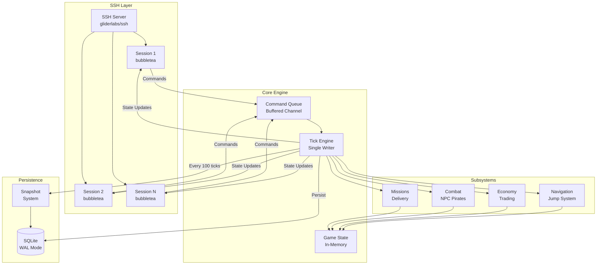
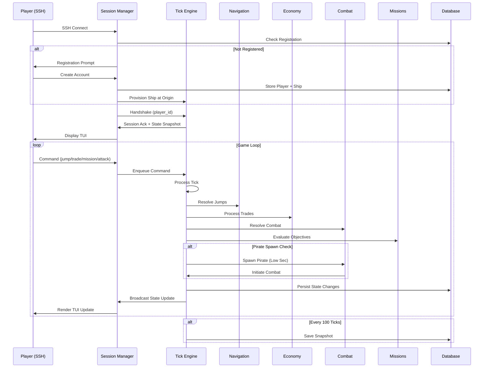

# Design Document: Milestone 2 - Vertical Slice (Phase 1)

## Overview

Milestone 2 delivers the complete Phase 1 playable game loop for BlackSector - a multiplayer text-based space trading game served over SSH. This milestone integrates all core systems into a cohesive, playable experience where players can register, navigate between star systems, trade commodities, complete delivery missions, and engage in combat with NPC pirates.

The vertical slice proves that the server architecture is sound, all subsystems integrate correctly, and the fundamental game loop is enjoyable. It builds on Milestone 1 (Foundation) which delivered the server infrastructure, SSH connectivity, handshake protocol, tick loop, and snapshot persistence.

Phase 1 scope includes: 15-20 star systems in one region, 7 commodities with static pricing, courier-class starter ships, jump-based navigation, port trading, simple delivery missions, turn-based NPC pirate combat, and a full TEXT mode TUI. The success criteria require that 5 concurrent players can complete profitable trade runs, survive combat encounters, and complete missions without server errors, with tick duration under 100ms.

## Architecture

The system follows a single-writer tick engine architecture where all game state mutations occur in a deterministic tick loop running at 2-second intervals. SSH sessions run in separate goroutines and communicate with the tick engine via channels - sessions send commands to the engine and receive state snapshots back. This design ensures thread-safe state management and enables snapshot-based persistence.




## Main Workflow: Player Game Loop



## Components and Interfaces

### Component 1: World Generator

**Purpose**: Generates the static Phase 1 universe with 15-20 star systems, jump connections, and ports.

**Interface**:
```go
package world

type Generator interface {
    // LoadWorld loads the static alpha_sector.json world configuration
    LoadWorld(configPath string) (*Universe, error)
    
    // ValidateTopology ensures all systems are reachable and jump connections are valid
    ValidateTopology(u *Universe) error
}

type Universe struct {
    Regions      map[int]*Region
    Systems      map[int]*System
    Ports        map[int]*Port
    JumpConnections []*JumpConnection
}

type Region struct {
    RegionID     int
    Name         string
    RegionType   string // "core", "industrial"
    SecurityLevel float64
}

type System struct {
    SystemID      int
    Name          string
    RegionID      int
    SecurityLevel float64 // 2.0 = Federated Space, 0.7-1.0 = High, 0.0-0.4 = Low
    PositionX     float64
    PositionY     float64
}

type Port struct {
    PortID        int
    SystemID      int
    Name          string
    PortType      string // "trading", "mining", "refueling"
    SecurityLevel float64
    Inventory     []*PortCommodity
}

type JumpConnection struct {
    ConnectionID      int
    FromSystemID      int
    ToSystemID        int
    Bidirectional     bool
    FuelCostModifier  float64
}
```

**Responsibilities**:
- Load static world configuration from JSON
- Validate system connectivity (all systems reachable)
- Initialize port inventories based on port type
- Ensure Federated Space origin starbase exists
- Provide world data to tick engine at startup


### Component 2: Navigation System

**Purpose**: Handles jump travel between star systems, fuel consumption, and system map display.

**Interface**:
```go
package navigation

type Navigator interface {
    // Jump attempts to move a ship to a connected system
    Jump(shipID string, targetSystemID int, currentTick int64) error
    
    // GetJumpConnections returns all valid jump destinations from a system
    GetJumpConnections(systemID int) ([]*JumpConnection, error)
    
    // CalculateFuelCost computes fuel cost for a jump
    CalculateFuelCost(fromSystemID, toSystemID int) (int, error)
    
    // ValidateJump checks if a jump is possible (connection exists, fuel available)
    ValidateJump(ship *Ship, targetSystemID int) error
}

type Ship struct {
    ShipID           string
    PlayerID         string
    ShipClass        string
    HullPoints       int
    MaxHullPoints    int
    ShieldPoints     int
    MaxShieldPoints  int
    EnergyPoints     int
    MaxEnergyPoints  int
    CargoCapacity    int
    CurrentSystemID  int
    PositionX        float64
    PositionY        float64
    Status           ShipStatus
    DockedAtPortID   *int
    LastUpdatedTick  int64
}

type ShipStatus string

const (
    StatusDocked    ShipStatus = "DOCKED"
    StatusInSpace   ShipStatus = "IN_SPACE"
    StatusInCombat  ShipStatus = "IN_COMBAT"
    StatusDestroyed ShipStatus = "DESTROYED"
)
```

**Responsibilities**:
- Validate jump connections exist between systems
- Calculate and deduct fuel costs (Phase 1: simplified model)
- Update ship position to destination system
- Prevent jumps while docked or in combat
- Trigger pirate spawn checks after jump (Low Security systems)


### Component 3: Economy System

**Purpose**: Manages commodity trading, port inventories, and credit transactions.

**Interface**:
```go
package economy

type Trader interface {
    // BuyCommodity purchases commodity from port to ship cargo
    BuyCommodity(shipID string, portID int, commodityID string, quantity int, tick int64) error
    
    // SellCommodity sells commodity from ship cargo to port
    SellCommodity(shipID string, portID int, commodityID string, quantity int, tick int64) error
    
    // GetMarketPrices returns current buy/sell prices at a port
    GetMarketPrices(portID int) ([]*MarketPrice, error)
    
    // CalculatePrice computes zone-adjusted price for a commodity
    CalculatePrice(basePrice int, securityLevel float64, isBuy bool) int
}

type MarketPrice struct {
    CommodityID string
    Name        string
    BuyPrice    int  // Port sells to player
    SellPrice   int  // Port buys from player
    Quantity    int  // Available stock
}

type Commodity struct {
    CommodityID   string
    Name          string
    Category      string // "essential", "industrial", "luxury"
    BasePrice     int
    Volatility    float64
    IsContraband  bool
}

type PortCommodity struct {
    PortID       int
    CommodityID  string
    Quantity     int
    BuyPrice     int
    SellPrice    int
    UpdatedTick  int64
}

type CargoSlot struct {
    ShipID      string
    SlotIndex   int
    CommodityID string
    Quantity    int
}
```

**Responsibilities**:
- Calculate zone-adjusted prices (Low Sec = 1.18x multiplier)
- Validate cargo capacity before purchases
- Validate player credits before purchases
- Update port inventory and player cargo atomically
- Apply buy/sell spread (±10% from zone price)
- Enforce port type commodity restrictions (trading/mining/refueling)


### Component 4: Combat System

**Purpose**: Resolves turn-based combat between players and NPC pirates.

**Interface**:
```go
package combat

type CombatResolver interface {
    // SpawnPirate creates a pirate encounter in Low Security systems
    SpawnPirate(systemID int, targetShipID string, tick int64) (*CombatInstance, error)
    
    // ProcessAttack resolves a player attack action
    ProcessAttack(combatID string, attackerID string, tick int64) (*CombatResult, error)
    
    // ProcessFlee attempts to disengage from combat
    ProcessFlee(combatID string, playerID string, tick int64) (*FleeResult, error)
    
    // ProcessSurrender ends combat with credit penalty
    ProcessSurrender(combatID string, playerID string, tick int64) error
    
    // ResolveCombatTick processes all active combat instances
    ResolveCombatTick(tick int64) ([]*CombatEvent, error)
}

type CombatInstance struct {
    CombatID      string
    PlayerShipID  string
    PirateShipID  string
    SystemID      int
    StartTick     int64
    Status        CombatStatus
    TurnNumber    int
}

type CombatStatus string

const (
    CombatActive   CombatStatus = "ACTIVE"
    CombatEnded    CombatStatus = "ENDED"
    CombatFled     CombatStatus = "FLED"
)

type PirateShip struct {
    ShipID        string
    Tier          string // "raider", "marauder"
    HullPoints    int
    MaxHull       int
    ShieldPoints  int
    MaxShield     int
    WeaponDamage  DamageRange
    Accuracy      float64
    FleeThreshold float64 // Flee when hull drops below this %
}

type DamageRange struct {
    Min int
    Max int
}

type CombatResult struct {
    Damage        int
    TargetHull    int
    TargetShield  int
    TargetDestroyed bool
}

type FleeResult struct {
    Success bool
    Reason  string
}
```

**Responsibilities**:
- Spawn pirates based on security zone (Low Sec only in Phase 1)
- Calculate hit probability based on pirate accuracy
- Apply damage to shields first, then hull
- Handle pirate flee behavior at threshold
- Process player surrender (40% credit loss)
- Trigger ship destruction and respawn on player death
- Remove ephemeral pirate entities after combat ends


### Component 5: Mission System

**Purpose**: Manages delivery mission lifecycle, objective tracking, and rewards.

**Interface**:
```go
package missions

type MissionManager interface {
    // LoadMissions loads mission definitions from config/missions/
    LoadMissions(configPath string) error
    
    // GetAvailableMissions returns missions available at a port
    GetAvailableMissions(portID int, playerID string) ([]*MissionListing, error)
    
    // AcceptMission creates a mission instance for a player
    AcceptMission(missionID string, playerID string, tick int64) error
    
    // GetActiveMission returns the player's current active mission
    GetActiveMission(playerID string) (*MissionInstance, error)
    
    // AbandonMission cancels the active mission
    AbandonMission(playerID string, tick int64) error
    
    // EvaluateObjectives checks mission progress each tick
    EvaluateObjectives(tick int64) ([]*MissionEvent, error)
}

type MissionDefinition struct {
    MissionID           string
    Name                string
    Description         string
    Version             string
    Author              string
    Enabled             bool
    Repeatable          bool
    RepeatCooldownTicks int
    SecurityZones       []string
    ExpiryTicks         *int
    Objectives          []*ObjectiveDefinition
    Rewards             *RewardDefinition
}

type ObjectiveDefinition struct {
    ObjectiveID  string
    Type         string // "deliver_commodity", "navigate_to", "kill"
    Description  string
    Parameters   map[string]interface{}
}

type MissionInstance struct {
    InstanceID            string
    MissionID             string
    PlayerID              string
    Status                MissionStatus
    CurrentObjectiveIndex int
    AcceptedTick          int64
    CompletedTick         *int64
    ExpiresAtTick         *int64
}

type MissionStatus string

const (
    MissionAvailable   MissionStatus = "AVAILABLE"
    MissionAccepted    MissionStatus = "ACCEPTED"
    MissionInProgress  MissionStatus = "IN_PROGRESS"
    MissionCompleted   MissionStatus = "COMPLETED"
    MissionFailed      MissionStatus = "FAILED"
    MissionExpired     MissionStatus = "EXPIRED"
    MissionAbandoned   MissionStatus = "ABANDONED"
)

type ObjectiveProgress struct {
    InstanceID      string
    ObjectiveIndex  int
    Status          string
    CurrentValue    int
    RequiredValue   int
}

type RewardDefinition struct {
    Credits int
    Items   []*ItemReward
}

type ItemReward struct {
    ItemID   string
    Quantity int
}

type MissionEvent struct {
    Type       string // "completed", "failed", "expired"
    InstanceID string
    PlayerID   string
    Tick       int64
}
```

**Responsibilities**:
- Load and validate mission JSON files at startup
- Filter missions by security zone and port
- Enforce one active mission per player (Phase 1 limit)
- Track objective progress (deliver_commodity only in Phase 1)
- Evaluate completion when player docks at destination port
- Distribute credit rewards on completion
- Handle mission expiry and abandonment


### Component 6: Registration System

**Purpose**: Handles new player registration and authentication via SSH.

**Interface**:
```go
package registration

type Registrar interface {
    // CheckPlayer verifies if a player exists by SSH username
    CheckPlayer(sshUsername string) (*Player, error)
    
    // RegisterNewPlayer creates account, token, and starting ship
    RegisterNewPlayer(req *RegistrationRequest) (*RegistrationResult, error)
    
    // ValidateToken authenticates a player token (for GUI clients)
    ValidateToken(token string) (*Player, error)
}

type RegistrationRequest struct {
    SSHUsername  string
    DisplayName  string
    Password     string
    RemoteAddr   string
}

type RegistrationResult struct {
    PlayerID    string
    PlayerToken string // Shown once, must be saved by player
    StartingShip *Ship
}

type Player struct {
    PlayerID      string
    PlayerName    string
    TokenHash     string
    Credits       int
    CreatedAt     int64
    LastLoginAt   int64
    IsBanned      bool
}
```

**Responsibilities**:
- Prompt new SSH users for registration
- Generate UUID player_id
- Hash password and token with bcrypt
- Create starting ship (courier class) at Federated Space origin
- Grant starting credits (10,000 configurable)
- Display player token once (must be saved)
- Validate returning player SSH connections
- Rate limit registration attempts per IP


### Component 7: TUI System

**Purpose**: Renders the TEXT mode terminal interface using bubbletea.

**Interface**:
```go
package tui

type ViewModel interface {
    // Init initializes the bubbletea model
    Init() tea.Cmd
    
    // Update processes messages and updates state
    Update(msg tea.Msg) (tea.Model, tea.Cmd)
    
    // View renders the current state to string
    View() string
}

type GameView struct {
    PlayerID      string
    SessionID     string
    CurrentState  *GameState
    InputMode     InputMode
    CommandBuffer string
    StatusBar     *StatusBar
    Logger        zerolog.Logger
}

type GameState struct {
    Ship          *Ship
    CurrentSystem *System
    DockedPort    *Port
    ActiveCombat  *CombatInstance
    ActiveMission *MissionInstance
    Tick          int64
}

type StatusBar struct {
    SystemName    string
    Credits       int
    Hull          int
    MaxHull       int
    Shield        int
    MaxShield     int
    Energy        int
    MaxEnergy     int
}

type InputMode string

const (
    ModeCommand InputMode = "COMMAND"
    ModeMarket  InputMode = "MARKET"
    ModeCombat  InputMode = "COMBAT"
)
```

**Responsibilities**:
- Render status bar with system, credits, hull/shield/energy
- Display command prompt and input buffer
- Show system map (ASCII list with jump connections)
- Render market listings with buy/sell prices
- Display combat interface with attack/flee/surrender options
- Show mission board and active mission status
- Handle command parsing and validation
- Apply lipgloss styles for ANSI color rendering


## Data Models

### Player and Ship Models

```go
// Player represents a registered account
type Player struct {
    PlayerID      string    // UUID
    PlayerName    string    // Unique, 3-20 chars
    TokenHash     string    // bcrypt hash
    Credits       int       // Wallet balance
    CreatedAt     int64     // Unix epoch
    LastLoginAt   int64
    IsBanned      bool
}

// Ship represents a player's vessel
type Ship struct {
    ShipID           string  // UUID
    PlayerID         string
    ShipClass        string  // "courier" in Phase 1
    HullPoints       int
    MaxHullPoints    int
    ShieldPoints     int
    MaxShieldPoints  int
    EnergyPoints     int
    MaxEnergyPoints  int
    CargoCapacity    int     // 20 for courier
    MissilesCurrent  int     // Not used in Phase 1
    CurrentSystemID  int
    PositionX        float64
    PositionY        float64
    Status           ShipStatus
    DockedAtPortID   *int
    LastUpdatedTick  int64
}

// CargoSlot represents one cargo hold entry
type CargoSlot struct {
    ShipID      string
    SlotIndex   int
    CommodityID string
    Quantity    int
}
```

**Validation Rules**:
- PlayerName must be unique and 3-20 characters
- Credits cannot go negative
- Ship cargo total cannot exceed CargoCapacity
- Ship can only dock when Status = IN_SPACE
- Ship cannot jump when Status = DOCKED or IN_COMBAT


### Universe Models

```go
// System represents a star system
type System struct {
    SystemID      int
    Name          string
    RegionID      int
    SecurityLevel float64  // 2.0 = Fed Space, 0.7-1.0 = High, 0.0-0.4 = Low
    PositionX     float64
    PositionY     float64
    HazardLevel   float64
}

// Port represents a trading station
type Port struct {
    PortID              int
    SystemID            int
    Name                string
    PortType            string  // "trading", "mining", "refueling"
    SecurityLevel       float64
    DockingFee          int
    HasBank             bool
    HasShipyard         bool
    HasUpgradeMarket    bool
    HasRepair           bool
    HasFuel             bool
}

// JumpConnection represents a navigable route
type JumpConnection struct {
    ConnectionID      int
    FromSystemID      int
    ToSystemID        int
    Bidirectional     bool
    FuelCostModifier  float64
}

// Commodity represents a tradable good
type Commodity struct {
    CommodityID   string  // "food_supplies", "fuel_cells", etc.
    Name          string
    Category      string  // "essential", "industrial", "luxury"
    BasePrice     int
    Volatility    float64
    IsContraband  bool
}
```

**Validation Rules**:
- SecurityLevel 2.0 reserved for Federated Space (origin)
- SecurityLevel 0.7-1.0 = High Security
- SecurityLevel 0.0-0.4 = Low Security (pirate spawns enabled)
- All systems must be reachable via jump connections
- Port inventories must match port type (trading/mining/refueling)


### Combat and Mission Models

```go
// CombatInstance represents an active combat encounter
type CombatInstance struct {
    CombatID      string
    PlayerShipID  string
    PirateShipID  string
    SystemID      int
    StartTick     int64
    Status        CombatStatus
    TurnNumber    int
}

// PirateShip represents an ephemeral NPC enemy
type PirateShip struct {
    ShipID        string
    Tier          string  // "raider" (70%), "marauder" (30%)
    HullPoints    int
    MaxHull       int
    ShieldPoints  int
    MaxShield     int
    WeaponDamageMin int
    WeaponDamageMax int
    Accuracy      float64  // 0.60 for raider, 0.65 for marauder
    FleeThreshold float64  // 0.15 for raider, 0.10 for marauder
}

// MissionInstance represents a player's active mission
type MissionInstance struct {
    InstanceID            string
    MissionID             string
    PlayerID              string
    Status                MissionStatus
    CurrentObjectiveIndex int
    AcceptedTick          int64
    CompletedTick         *int64
    ExpiresAtTick         *int64
}

// ObjectiveProgress tracks mission objective completion
type ObjectiveProgress struct {
    InstanceID      string
    ObjectiveIndex  int
    Status          string  // "PENDING", "ACTIVE", "COMPLETED"
    CurrentValue    int     // e.g., commodities delivered
    RequiredValue   int     // e.g., total commodities needed
}
```

**Validation Rules**:
- Only one CombatInstance per ship at a time
- Pirates are ephemeral (not persisted after combat ends)
- Only one active MissionInstance per player (Phase 1 limit)
- Objective progress must be evaluated each tick
- Mission expires if ExpiresAtTick is reached before completion


## Key Functions with Formal Specifications

### Function 1: ProcessJump()

```go
func (n *Navigator) ProcessJump(shipID string, targetSystemID int, currentTick int64) error
```

**Preconditions:**
- Ship exists and is owned by an active player
- Ship status is IN_SPACE (not DOCKED or IN_COMBAT)
- Jump connection exists from ship's current system to target system
- Ship has sufficient fuel (Phase 1: simplified, always true)

**Postconditions:**
- Ship's CurrentSystemID is updated to targetSystemID
- Ship's LastUpdatedTick is set to currentTick
- Database ship record is updated
- If target system is Low Security, pirate spawn check is triggered
- Returns nil on success, typed error on failure

**Loop Invariants:** N/A (no loops in this function)


### Function 2: BuyCommodity()

```go
func (t *Trader) BuyCommodity(shipID string, portID int, commodityID string, quantity int, tick int64) error
```

**Preconditions:**
- Ship is docked at the specified port (Status = DOCKED, DockedAtPortID = portID)
- Port has sufficient commodity quantity in inventory
- Player has sufficient credits for purchase (quantity × buyPrice)
- Ship has sufficient cargo capacity (current cargo + quantity ≤ CargoCapacity)
- Commodity is available at this port type

**Postconditions:**
- Player credits decreased by (quantity × buyPrice)
- Port inventory quantity decreased by quantity
- Ship cargo updated with commodity (new slot or existing slot quantity increased)
- Database transaction commits atomically (credits, inventory, cargo)
- Returns nil on success, typed error on failure (ErrInsufficientCredits, ErrInsufficientCargo, etc.)

**Loop Invariants:** N/A

### Function 3: ProcessAttack()

```go
func (c *CombatResolver) ProcessAttack(combatID string, attackerID string, tick int64) (*CombatResult, error)
```

**Preconditions:**
- CombatInstance exists and is ACTIVE
- Attacker is the player in this combat instance
- Combat turn has not been processed this tick
- Player ship is not destroyed (HullPoints > 0)

**Postconditions:**
- Damage calculated based on weapon stats (courier: 15 damage)
- Damage applied to pirate shields first, then hull
- If pirate hull ≤ 0: pirate destroyed, combat ends, CombatInstance status = ENDED
- If pirate hull ≤ fleeThreshold: pirate flees, combat ends, CombatInstance status = FLED
- Pirate counter-attack processed (if pirate survives and doesn't flee)
- Combat turn number incremented
- Returns CombatResult with damage dealt and target status

**Loop Invariants:** N/A


### Function 4: EvaluateObjectives()

```go
func (m *MissionManager) EvaluateObjectives(tick int64) ([]*MissionEvent, error)
```

**Preconditions:**
- Mission definitions loaded from config/missions/
- Database contains active MissionInstance records (Status = IN_PROGRESS)
- Objective progress records exist for all active missions

**Postconditions:**
- For each IN_PROGRESS mission:
  - Current objective evaluated against game state
  - If objective complete: CurrentObjectiveIndex incremented or mission marked COMPLETED
  - If final objective complete: rewards distributed, Status = COMPLETED
  - If ExpiresAtTick reached: Status = EXPIRED
- Database updated with new mission status and objective progress
- Returns list of MissionEvent for completed/failed/expired missions
- All evaluations complete within 5ms per tick (performance constraint)

**Loop Invariants:**
- For each mission in active missions list:
  - Mission status remains consistent (no partial updates)
  - Objective index never decrements
  - Rewards distributed exactly once per completion


## Algorithmic Pseudocode

### Main Tick Loop Algorithm

```go
// TickEngine.runTickLoop processes all game state updates each tick
func (te *TickEngine) runTickLoop() {
    ticker := time.NewTicker(te.cfg.TickInterval)
    defer ticker.Stop()
    
    for {
        select {
        case <-ticker.C:
            te.processTick()
        case <-te.stopChan:
            return
        }
    }
}

func (te *TickEngine) processTick() {
    te.mu.Lock()
    defer te.mu.Unlock()
    
    startTime := time.Now()
    te.tickNumber++
    
    // STEP 1: Drain command queue
    commands := te.drainCommandQueue()
    
    // STEP 2: Process commands by type
    for _, cmd := range commands {
        switch cmd.Type {
        case "jump":
            te.navigation.ProcessJump(cmd.ShipID, cmd.TargetSystemID, te.tickNumber)
        case "dock":
            te.navigation.ProcessDock(cmd.ShipID, cmd.PortID, te.tickNumber)
        case "undock":
            te.navigation.ProcessUndock(cmd.ShipID, te.tickNumber)
        case "buy":
            te.economy.BuyCommodity(cmd.ShipID, cmd.PortID, cmd.CommodityID, cmd.Quantity, te.tickNumber)
        case "sell":
            te.economy.SellCommodity(cmd.ShipID, cmd.PortID, cmd.CommodityID, cmd.Quantity, te.tickNumber)
        case "attack":
            te.combat.ProcessAttack(cmd.CombatID, cmd.ShipID, te.tickNumber)
        case "flee":
            te.combat.ProcessFlee(cmd.CombatID, cmd.ShipID, te.tickNumber)
        case "surrender":
            te.combat.ProcessSurrender(cmd.CombatID, cmd.ShipID, te.tickNumber)
        case "mission_accept":
            te.missions.AcceptMission(cmd.MissionID, cmd.PlayerID, te.tickNumber)
        case "mission_abandon":
            te.missions.AbandonMission(cmd.PlayerID, te.tickNumber)
        }
    }
    
    // STEP 3: Resolve combat turns
    te.combat.ResolveCombatTick(te.tickNumber)
    
    // STEP 4: Check pirate spawns (Low Security systems only)
    te.combat.CheckPirateSpawns(te.tickNumber)
    
    // STEP 5: Evaluate mission objectives
    te.missions.EvaluateObjectives(te.tickNumber)
    
    // STEP 6: Persist state changes
    te.db.CommitTick(te.tickNumber)
    
    // STEP 7: Broadcast state updates to sessions
    te.broadcastStateUpdates()
    
    // STEP 8: Snapshot every 100 ticks
    if te.tickNumber % 100 == 0 {
        te.snapshot.Save(te.tickNumber)
    }
    
    duration := time.Since(startTime)
    te.logger.Debug().
        Int64("tick", te.tickNumber).
        Dur("duration", duration).
        Msg("tick completed")
    
    if duration > 100*time.Millisecond {
        te.logger.Warn().
            Int64("tick", te.tickNumber).
            Dur("duration", duration).
            Msg("tick exceeded 100ms threshold")
    }
}
```

**Preconditions:**
- TickEngine initialized with valid config, database, and subsystems
- Database connection established with WAL mode enabled
- All subsystems (navigation, economy, combat, missions) initialized

**Postconditions:**
- All queued commands processed or rejected with errors
- Combat instances advanced one turn
- Mission objectives evaluated
- Database committed with all state changes
- State updates broadcast to all active sessions
- Tick completes within 100ms (performance target)

**Loop Invariants:**
- Tick number monotonically increases
- No command processed twice in same tick
- Database remains consistent (all writes in transaction)
- Session channels never block (buffered)


### Pirate Spawn Algorithm

```go
func (c *CombatResolver) CheckPirateSpawns(tick int64) {
    // Only check every N ticks (configurable, default 5)
    if tick % c.cfg.SpawnCheckInterval != 0 {
        return
    }
    
    // Get all ships in space (not docked, not in combat)
    ships := c.db.GetShipsInSpace()
    
    for _, ship := range ships {
        system := c.world.GetSystem(ship.CurrentSystemID)
        
        // Skip if not Low Security (0.0 - 0.4)
        if system.SecurityLevel >= 0.4 {
            continue
        }
        
        // Calculate spawn chance
        spawnChance := c.cfg.PirateActivityBase * (1.0 - system.SecurityLevel)
        roll := rand.Float64()
        
        if roll < spawnChance {
            // Spawn pirate encounter
            tier := c.selectPirateTier() // 70% raider, 30% marauder
            pirate := c.createPirate(tier, system.SystemID)
            combat := c.createCombatInstance(ship.ShipID, pirate.ShipID, system.SystemID, tick)
            
            c.logger.Info().
                Str("player_id", ship.PlayerID).
                Str("system", system.Name).
                Str("pirate_tier", tier).
                Msg("pirate encounter spawned")
            
            // Notify player session
            c.notifyPirateEncounter(ship.PlayerID, combat.CombatID)
        }
    }
}

func (c *CombatResolver) selectPirateTier() string {
    roll := rand.Float64()
    if roll < 0.70 {
        return "raider"
    }
    return "marauder"
}
```

**Preconditions:**
- Spawn check interval reached (tick % interval == 0)
- World data loaded with system security levels
- Pirate tier configuration loaded from config

**Postconditions:**
- For each ship in Low Security space:
  - Spawn probability calculated based on security level
  - If spawn triggered: pirate created, combat instance created
  - Player notified of encounter
- No spawns in High Security or Federated Space
- Pirate stats match tier configuration (raider/marauder)

**Loop Invariants:**
- For each ship checked:
  - Only one pirate spawned per ship per check
  - Spawn probability deterministic based on security level
  - No pirate spawns if ship already in combat


### Price Calculation Algorithm

```go
func (e *Economy) CalculatePrice(basePrice int, securityLevel float64, isBuy bool) int {
    // Determine zone multiplier
    var zoneMultiplier float64
    if securityLevel == 2.0 {
        // Federated Space - base prices
        zoneMultiplier = 1.0
    } else if securityLevel >= 0.7 {
        // High Security - base prices
        zoneMultiplier = 1.0
    } else if securityLevel < 0.4 {
        // Low Security - 18% premium
        zoneMultiplier = e.cfg.LowSecPriceMultiplier // 1.18
    } else {
        // Medium Security (Phase 2) - base prices
        zoneMultiplier = 1.0
    }
    
    // Apply zone adjustment
    zonePrice := int(float64(basePrice) * zoneMultiplier)
    
    // Apply buy/sell spread (±10%)
    var finalPrice int
    if isBuy {
        // Port sells to player - 10% markup
        finalPrice = int(float64(zonePrice) * 1.10)
    } else {
        // Port buys from player - 10% markdown
        finalPrice = int(float64(zonePrice) * 0.90)
    }
    
    return finalPrice
}
```

**Preconditions:**
- basePrice > 0 (from commodity definition)
- securityLevel is valid (2.0 for Fed Space, 0.0-1.0 for others)
- Config loaded with LowSecPriceMultiplier

**Postconditions:**
- Returns zone-adjusted price with buy/sell spread applied
- Low Security prices are ~18% higher than High Security
- Buy prices are 10% above zone price
- Sell prices are 10% below zone price
- Price is always positive integer

**Loop Invariants:** N/A


### Combat Damage Resolution Algorithm

```go
func (c *CombatResolver) resolveDamage(attacker *Ship, defender *Ship, accuracy float64) *CombatResult {
    // Roll for hit
    hitRoll := rand.Float64()
    if hitRoll > accuracy {
        return &CombatResult{
            Hit:    false,
            Damage: 0,
        }
    }
    
    // Calculate damage (fixed for Phase 1)
    damage := attacker.WeaponDamage // 15 for courier, 12-18 for raiders
    
    // Apply to shields first
    shieldDamage := min(damage, defender.ShieldPoints)
    defender.ShieldPoints -= shieldDamage
    remainingDamage := damage - shieldDamage
    
    // Apply remaining to hull
    hullDamage := min(remainingDamage, defender.HullPoints)
    defender.HullPoints -= hullDamage
    
    destroyed := defender.HullPoints <= 0
    
    return &CombatResult{
        Hit:             true,
        Damage:          damage,
        ShieldDamage:    shieldDamage,
        HullDamage:      hullDamage,
        TargetShield:    defender.ShieldPoints,
        TargetHull:      defender.HullPoints,
        TargetDestroyed: destroyed,
    }
}

func min(a, b int) int {
    if a < b {
        return a
    }
    return b
}
```

**Preconditions:**
- Attacker and defender ships exist and are in combat
- Accuracy is between 0.0 and 1.0
- Ship stats are valid (hull, shield, damage > 0)

**Postconditions:**
- Hit determined by random roll vs accuracy
- If hit: damage applied to shields first, then hull
- Shield and hull points never go negative (clamped to 0)
- Destroyed flag set if hull reaches 0
- Returns CombatResult with all damage details

**Loop Invariants:** N/A


## Example Usage

### Example 1: Complete Trade Run

```go
// Player connects via SSH
session := sshserver.NewSession(conn, logger)

// Registration (if new player)
if !session.IsRegistered() {
    player, ship := registration.RegisterNewPlayer(&RegistrationRequest{
        SSHUsername: "nova",
        DisplayName: "Nova",
        Password:    "secure123",
    })
    // Player receives token: "bXlzZWNyZXR0b2tlbmhlcmVmb3JleGFtcGxl"
    // Ship spawned at Federated Space origin with 10,000 credits
}

// Handshake
session.SendHandshake()
state := session.ReceiveState()

// Player is docked at origin starbase in Federated Space
// View market
market := economy.GetMarketPrices(state.Ship.DockedAtPortID)
// Shows: food_supplies buy=110, sell=90 (base prices in Fed Space)

// Buy commodity
economy.BuyCommodity(state.Ship.ShipID, state.Ship.DockedAtPortID, "food_supplies", 15, tick)
// Credits: 10,000 - (15 × 110) = 8,350
// Cargo: 15/20 used

// Undock
navigation.ProcessUndock(state.Ship.ShipID, tick)

// Jump to Low Security system
navigation.ProcessJump(state.Ship.ShipID, targetSystemID, tick)
// Pirate spawn check triggered (8% chance in Low Sec)

// Dock at mining port in Low Security
navigation.ProcessDock(state.Ship.ShipID, miningPortID, tick)

// View market (Low Sec prices)
market = economy.GetMarketPrices(miningPortID)
// Shows: food_supplies buy=130, sell=106 (1.18x multiplier)

// Sell commodity
economy.SellCommodity(state.Ship.ShipID, miningPortID, "food_supplies", 15, tick)
// Credits: 8,350 + (15 × 106) = 9,940
// Profit: -60 credits (lost money due to spread, but demonstrates mechanics)
```


### Example 2: Combat Encounter

```go
// Player jumps to Low Security system
navigation.ProcessJump(state.Ship.ShipID, lowSecSystemID, tick)

// Pirate spawn check (next tick)
// Roll: 0.07 < 0.08 (spawn chance) → pirate spawns
pirate := combat.SpawnPirate(lowSecSystemID, state.Ship.ShipID, tick)
// Tier: "raider" (70% chance)
// Stats: Hull=60, Shield=20, Damage=12-18, Accuracy=60%

// Player receives notification
// "⚠ PIRATE INTERCEPT — A hostile vessel has locked on to your position."

// Player attacks
result := combat.ProcessAttack(combatID, state.Ship.ShipID, tick)
// Player damage: 15
// Hit roll: 0.55 < 1.0 → hit
// Pirate shield: 20 - 15 = 5
// Pirate hull: 60 (unchanged)

// Pirate counter-attacks
pirateResult := combat.ProcessPirateAttack(combatID, tick)
// Pirate damage: 14 (random 12-18)
// Hit roll: 0.65 > 0.60 → miss

// Player attacks again
result = combat.ProcessAttack(combatID, state.Ship.ShipID, tick)
// Damage: 15
// Pirate shield: 5 - 15 = 0, hull: 60 - 10 = 50

// Continue combat...
// Pirate hull drops to 8 (< 15% of 60)
// Pirate flees
// "PIRATE RETREATS — The hostile vessel has broken off and fled."

// Combat ends, player continues
```


### Example 3: Delivery Mission

```go
// Player docks at trading port
navigation.ProcessDock(state.Ship.ShipID, tradingPortID, tick)

// View available missions
missions := missionMgr.GetAvailableMissions(tradingPortID, state.PlayerID)
// Shows: "Emergency Ore Delivery" - Deliver 15 refined_ore to Station Ironhold

// Accept mission
missionMgr.AcceptMission("emergency_ore_run", state.PlayerID, tick)
// Mission instance created, status = IN_PROGRESS
// Objective 1: acquire_commodity (refined_ore, 15)

// Buy commodity
economy.BuyCommodity(state.Ship.ShipID, tradingPortID, "refined_ore", 15, tick)
// Credits: 10,000 - (15 × 264) = 6,040
// Cargo: 15/20 used

// Objective 1 complete (evaluated next tick)
// Objective 2 activated: deliver_commodity to Station Ironhold

// Navigate to destination system
navigation.ProcessJump(state.Ship.ShipID, destinationSystemID, tick)

// Dock at Station Ironhold
navigation.ProcessDock(state.Ship.ShipID, ironholdPortID, tick)

// Mission objective evaluated (player docked at correct port with commodity)
// Objective 2 complete
// Mission status = COMPLETED

// Rewards distributed
// Credits: 6,040 + 8,000 = 14,040
// Items: 2× repair_kit added to cargo

// Mission completion notification
// "MISSION COMPLETED — Emergency Ore Delivery. Reward: 8,000 credits."
```


## Correctness Properties

### Property 1: State Consistency
**Universal Quantification**: For all ticks T, all game state mutations occur atomically within the tick engine's transaction boundary.

**Verification**: 
- All database writes wrapped in single transaction per tick
- Transaction commits or rolls back completely
- No partial state updates visible to sessions
- Snapshot captures consistent state at tick boundary

### Property 2: Command Ordering
**Universal Quantification**: For all commands C submitted by session S at tick T, C is processed in FIFO order within tick T or T+1.

**Verification**:
- Commands enqueued to buffered channel in submission order
- Tick engine drains queue in order
- No command reordering within tick processing
- Commands never lost (channel buffer sized appropriately)

### Property 3: Credit Conservation
**Universal Quantification**: For all transactions (buy, sell, mission reward), the sum of all player credits plus port credits remains constant (excluding mission rewards which inject new credits).

**Verification**:
- Buy: player credits decrease by exact amount port credits increase
- Sell: port credits decrease by exact amount player credits increase
- Mission rewards: new credits injected, logged as economy event
- No credit duplication or loss in transactions

### Property 4: Cargo Capacity
**Universal Quantification**: For all ships S, the sum of cargo quantities never exceeds S.CargoCapacity.

**Verification**:
- Buy operation validates available capacity before transaction
- Cargo capacity checked: current_cargo + purchase_quantity ≤ CargoCapacity
- Transaction rejected if capacity exceeded
- Cargo slots accurately track quantities

### Property 5: Combat Exclusivity
**Universal Quantification**: For all ships S, at most one CombatInstance exists where S is a participant at any tick T.

**Verification**:
- Combat spawn checks ship status before creating instance
- Ship status set to IN_COMBAT when combat begins
- No new combat can start while status = IN_COMBAT
- Combat instance removed when combat ends, status reset


### Property 6: Mission Uniqueness
**Universal Quantification**: For all players P, at most one MissionInstance exists with Status = IN_PROGRESS at any tick T.

**Verification**:
- AcceptMission checks for existing IN_PROGRESS missions before creating new instance
- Transaction rejected if active mission exists
- Mission completion atomically updates status
- Abandoned missions immediately set status to ABANDONED

### Property 7: Pirate Spawn Fairness
**Universal Quantification**: For all Low Security systems S with SecurityLevel L, pirate spawn probability P = ActivityBase × (1 - L) is applied consistently per spawn check interval.

**Verification**:
- Spawn probability calculated deterministically from security level
- Random roll compared against calculated probability
- No spawn bias based on player identity or history
- Spawn checks occur at fixed interval (every N ticks)

### Property 8: Price Determinism
**Universal Quantification**: For all commodities C at port P with security level S, the buy/sell prices are deterministic functions of C.BasePrice and S.

**Verification**:
- Price calculation uses only basePrice and securityLevel inputs
- No random variation in Phase 1 (static pricing)
- Zone multiplier applied consistently (Low Sec = 1.18x)
- Buy/sell spread applied consistently (±10%)

### Property 9: Snapshot Consistency
**Universal Quantification**: For all snapshots taken at tick T, the snapshot contains complete and consistent game state that can restore the server to tick T.

**Verification**:
- Snapshot captures all persistent entities (players, ships, missions, combat)
- Snapshot taken after tick transaction commits
- Restore from snapshot produces identical game state
- No partial or corrupted snapshots written

### Property 10: Session Isolation
**Universal Quantification**: For all sessions S1 and S2, commands from S1 never affect S2's command processing order or state visibility.

**Verification**:
- Each session has independent command channel
- Tick engine processes all commands before broadcasting updates
- State updates broadcast to all sessions simultaneously
- No session can observe partial tick state


## Error Handling

### Error Scenario 1: Insufficient Credits

**Condition**: Player attempts to buy commodity but has insufficient credits

**Response**: 
```go
var ErrInsufficientCredits = errors.New("insufficient credits for purchase")

func (t *Trader) BuyCommodity(...) error {
    totalCost := quantity * buyPrice
    if player.Credits < totalCost {
        return fmt.Errorf("buy commodity: %w", ErrInsufficientCredits)
    }
    // ... proceed with transaction
}
```

**Recovery**: 
- Error returned to session layer
- Session displays error message to player
- No state changes occur
- Player can retry with smaller quantity

### Error Scenario 2: Invalid Jump Connection

**Condition**: Player attempts to jump to system with no connection

**Response**:
```go
var ErrInvalidJumpConnection = errors.New("no jump connection exists")

func (n *Navigator) ProcessJump(...) error {
    conn := n.findConnection(ship.CurrentSystemID, targetSystemID)
    if conn == nil {
        return fmt.Errorf("jump to system %d: %w", targetSystemID, ErrInvalidJumpConnection)
    }
    // ... proceed with jump
}
```

**Recovery**:
- Error returned to session layer
- Session displays available jump connections
- Ship remains in current system
- Player can view system map and retry

### Error Scenario 3: Ship Destroyed in Combat

**Condition**: Player ship hull reaches 0 during combat

**Response**:
```go
func (c *CombatResolver) ProcessAttack(...) (*CombatResult, error) {
    // ... apply damage
    if playerShip.HullPoints <= 0 {
        c.handleShipDestruction(playerShip)
        return &CombatResult{TargetDestroyed: true}, nil
    }
}

func (c *CombatResolver) handleShipDestruction(ship *Ship) {
    // Log destruction event
    c.logger.Info().
        Str("player_id", ship.PlayerID).
        Str("ship_id", ship.ShipID).
        Msg("ship destroyed")
    
    // Drop cargo (Phase 1: cargo lost, not dropped as loot)
    c.db.ClearCargo(ship.ShipID)
    
    // Respawn at nearest port with insurance payout
    nearestPort := c.world.FindNearestPort(ship.CurrentSystemID)
    ship.CurrentSystemID = nearestPort.SystemID
    ship.DockedAtPortID = &nearestPort.PortID
    ship.Status = StatusDocked
    ship.HullPoints = ship.MaxHullPoints
    ship.ShieldPoints = ship.MaxShieldPoints
    
    // Insurance payout (configurable, default 5000 credits)
    player := c.db.GetPlayer(ship.PlayerID)
    player.Credits += c.cfg.InsurancePayout
    
    c.db.UpdateShip(ship)
    c.db.UpdatePlayer(player)
}
```

**Recovery**:
- Ship respawns at nearest port
- Hull and shields restored to max
- Cargo lost
- Insurance payout granted (5000 credits default)
- Player can continue playing immediately


### Error Scenario 4: Database Connection Lost

**Condition**: SQLite database becomes unavailable during tick processing

**Response**:
```go
func (te *TickEngine) processTick() {
    defer func() {
        if r := recover(); r != nil {
            te.logger.Error().
                Interface("panic", r).
                Msg("tick panic recovered")
            // Attempt to reconnect database
            te.reconnectDatabase()
        }
    }()
    
    // ... tick processing
    
    if err := te.db.CommitTick(te.tickNumber); err != nil {
        te.logger.Error().
            Err(err).
            Int64("tick", te.tickNumber).
            Msg("failed to commit tick")
        
        // Rollback transaction
        te.db.Rollback()
        
        // Restore from last snapshot
        te.restoreFromSnapshot()
        return
    }
}
```

**Recovery**:
- Tick transaction rolled back
- Server attempts database reconnection
- If reconnection fails: restore from last snapshot
- Sessions notified of temporary unavailability
- Server continues from last known good state

### Error Scenario 5: Mission File Invalid

**Condition**: Mission JSON file fails schema validation during load

**Response**:
```go
func (m *MissionManager) LoadMissions(configPath string) error {
    files, err := os.ReadDir(configPath)
    if err != nil {
        return fmt.Errorf("read mission directory: %w", err)
    }
    
    for _, file := range files {
        if !strings.HasSuffix(file.Name(), ".json") {
            continue
        }
        
        data, err := os.ReadFile(filepath.Join(configPath, file.Name()))
        if err != nil {
            m.logger.Error().
                Err(err).
                Str("file", file.Name()).
                Msg("failed to read mission file")
            continue // Skip this file, continue loading others
        }
        
        var missions MissionFile
        if err := json.Unmarshal(data, &missions); err != nil {
            m.logger.Error().
                Err(err).
                Str("file", file.Name()).
                Msg("invalid mission JSON")
            continue // Skip this file
        }
        
        if err := m.validateMissions(&missions); err != nil {
            m.logger.Error().
                Err(err).
                Str("file", file.Name()).
                Msg("mission validation failed")
            continue // Skip this file
        }
        
        m.registerMissions(&missions)
    }
    
    return nil // Server continues with valid missions loaded
}
```

**Recovery**:
- Invalid mission file logged and skipped
- Other valid mission files continue loading
- Server starts with subset of missions
- Admin can fix invalid file and hot-reload


## Testing Strategy

### Unit Testing Approach

All game logic packages require unit tests with 80%+ coverage target for critical systems (combat, economy, engine).

**Combat System Tests**:
```go
func TestResolveDamage(t *testing.T) {
    tests := []struct {
        name            string
        attackerDamage  int
        defenderShield  int
        defenderHull    int
        accuracy        float64
        expectedHit     bool
        expectedShield  int
        expectedHull    int
        expectedDestroy bool
    }{
        {
            name:            "hit_shield_only",
            attackerDamage:  15,
            defenderShield:  50,
            defenderHull:    100,
            accuracy:        1.0, // Always hit
            expectedHit:     true,
            expectedShield:  35,
            expectedHull:    100,
            expectedDestroy: false,
        },
        {
            name:            "hit_shield_and_hull",
            attackerDamage:  15,
            defenderShield:  10,
            defenderHull:    100,
            accuracy:        1.0,
            expectedHit:     true,
            expectedShield:  0,
            expectedHull:    95,
            expectedDestroy: false,
        },
        {
            name:            "destroy_target",
            attackerDamage:  15,
            defenderShield:  0,
            defenderHull:    10,
            accuracy:        1.0,
            expectedHit:     true,
            expectedShield:  0,
            expectedHull:    0,
            expectedDestroy: true,
        },
        {
            name:            "miss",
            attackerDamage:  15,
            defenderShield:  50,
            defenderHull:    100,
            accuracy:        0.0, // Always miss
            expectedHit:     false,
            expectedShield:  50,
            expectedHull:    100,
            expectedDestroy: false,
        },
    }
    
    for _, tt := range tests {
        t.Run(tt.name, func(t *testing.T) {
            attacker := &Ship{WeaponDamage: tt.attackerDamage}
            defender := &Ship{
                ShieldPoints: tt.defenderShield,
                HullPoints:   tt.defenderHull,
            }
            
            resolver := NewCombatResolver(nil, nil, zerolog.Nop())
            result := resolver.resolveDamage(attacker, defender, tt.accuracy)
            
            assert.Equal(t, tt.expectedHit, result.Hit)
            assert.Equal(t, tt.expectedShield, defender.ShieldPoints)
            assert.Equal(t, tt.expectedHull, defender.HullPoints)
            assert.Equal(t, tt.expectedDestroy, result.TargetDestroyed)
        })
    }
}
```

**Economy System Tests**:
```go
func TestCalculatePrice(t *testing.T) {
    tests := []struct {
        name          string
        basePrice     int
        securityLevel float64
        isBuy         bool
        expected      int
    }{
        {
            name:          "fed_space_buy",
            basePrice:     100,
            securityLevel: 2.0,
            isBuy:         true,
            expected:      110, // 100 × 1.0 × 1.10
        },
        {
            name:          "high_sec_sell",
            basePrice:     100,
            securityLevel: 0.8,
            isBuy:         false,
            expected:      90, // 100 × 1.0 × 0.90
        },
        {
            name:          "low_sec_buy",
            basePrice:     100,
            securityLevel: 0.2,
            isBuy:         true,
            expected:      129, // 100 × 1.18 × 1.10 = 129.8 → 129
        },
        {
            name:          "low_sec_sell",
            basePrice:     100,
            securityLevel: 0.2,
            isBuy:         false,
            expected:      106, // 100 × 1.18 × 0.90 = 106.2 → 106
        },
    }
    
    for _, tt := range tests {
        t.Run(tt.name, func(t *testing.T) {
            cfg := &Config{LowSecPriceMultiplier: 1.18}
            economy := NewEconomy(cfg, nil, zerolog.Nop())
            
            result := economy.CalculatePrice(tt.basePrice, tt.securityLevel, tt.isBuy)
            assert.Equal(t, tt.expected, result)
        })
    }
}
```


### Integration Testing Approach

Integration tests verify subsystem interactions using real in-memory SQLite database.

**Complete Trade Flow Test**:
```go
func TestCompleteTradeFlow(t *testing.T) {
    // Setup in-memory database
    db := setupTestDatabase(t)
    defer db.Close()
    
    // Create test world
    world := createTestWorld(t, db)
    
    // Create test player and ship
    player := createTestPlayer(t, db, "test_player", 10000)
    ship := createTestShip(t, db, player.PlayerID, world.FedSpacePort.PortID)
    
    // Initialize subsystems
    cfg := &Config{LowSecPriceMultiplier: 1.18}
    economy := NewEconomy(cfg, db, zerolog.Nop())
    navigation := NewNavigation(world, db, zerolog.Nop())
    
    // Test: Buy commodity at Fed Space
    err := economy.BuyCommodity(ship.ShipID, world.FedSpacePort.PortID, "food_supplies", 15, 1)
    require.NoError(t, err)
    
    // Verify credits deducted
    player = db.GetPlayer(player.PlayerID)
    assert.Equal(t, 10000-(15*110), player.Credits)
    
    // Verify cargo added
    cargo := db.GetCargo(ship.ShipID)
    assert.Len(t, cargo, 1)
    assert.Equal(t, "food_supplies", cargo[0].CommodityID)
    assert.Equal(t, 15, cargo[0].Quantity)
    
    // Test: Undock
    err = navigation.ProcessUndock(ship.ShipID, 2)
    require.NoError(t, err)
    
    // Test: Jump to Low Sec system
    err = navigation.ProcessJump(ship.ShipID, world.LowSecSystem.SystemID, 3)
    require.NoError(t, err)
    
    // Verify ship moved
    ship = db.GetShip(ship.ShipID)
    assert.Equal(t, world.LowSecSystem.SystemID, ship.CurrentSystemID)
    
    // Test: Dock at Low Sec port
    err = navigation.ProcessDock(ship.ShipID, world.LowSecPort.PortID, 4)
    require.NoError(t, err)
    
    // Test: Sell commodity at Low Sec
    err = economy.SellCommodity(ship.ShipID, world.LowSecPort.PortID, "food_supplies", 15, 5)
    require.NoError(t, err)
    
    // Verify credits increased
    player = db.GetPlayer(player.PlayerID)
    expectedCredits := 10000 - (15*110) + (15*106)
    assert.Equal(t, expectedCredits, player.Credits)
    
    // Verify cargo removed
    cargo = db.GetCargo(ship.ShipID)
    assert.Len(t, cargo, 0)
}
```

**Combat Integration Test**:
```go
func TestCombatEncounter(t *testing.T) {
    db := setupTestDatabase(t)
    defer db.Close()
    
    world := createTestWorld(t, db)
    player := createTestPlayer(t, db, "test_player", 10000)
    ship := createTestShip(t, db, player.PlayerID, world.LowSecSystem.SystemID)
    ship.Status = StatusInSpace
    db.UpdateShip(ship)
    
    cfg := &Config{
        PirateActivityBase:    0.10,
        SpawnCheckInterval:    5,
        InsurancePayout:       5000,
    }
    combat := NewCombatResolver(cfg, db, world, zerolog.Nop())
    
    // Spawn pirate
    pirateInstance, err := combat.SpawnPirate(world.LowSecSystem.SystemID, ship.ShipID, 1)
    require.NoError(t, err)
    require.NotNil(t, pirateInstance)
    
    // Player attacks until pirate destroyed or flees
    for i := 0; i < 10; i++ {
        result, err := combat.ProcessAttack(pirateInstance.CombatID, ship.ShipID, int64(i+2))
        require.NoError(t, err)
        
        if result.TargetDestroyed {
            // Verify combat ended
            instance := db.GetCombatInstance(pirateInstance.CombatID)
            assert.Equal(t, CombatEnded, instance.Status)
            break
        }
        
        if instance := db.GetCombatInstance(pirateInstance.CombatID); instance.Status == CombatFled {
            // Pirate fled
            break
        }
    }
}
```


### Load Testing Approach

Load tests verify server performance with multiple concurrent players.

**5 Concurrent Players Test**:
```go
func TestFiveConcurrentPlayers(t *testing.T) {
    // Start server
    server := startTestServer(t)
    defer server.Stop()
    
    // Create 5 player sessions
    var wg sync.WaitGroup
    tickDurations := make(chan time.Duration, 100)
    
    for i := 0; i < 5; i++ {
        wg.Add(1)
        go func(playerNum int) {
            defer wg.Done()
            
            // Connect and register
            session := connectTestSession(t, server, fmt.Sprintf("player%d", playerNum))
            defer session.Close()
            
            // Execute random commands for 60 seconds
            timeout := time.After(60 * time.Second)
            for {
                select {
                case <-timeout:
                    return
                default:
                    // Random action: jump, trade, or wait
                    action := rand.Intn(3)
                    switch action {
                    case 0:
                        session.SendCommand("jump", randomSystem())
                    case 1:
                        session.SendCommand("buy", "food_supplies", "5")
                    case 2:
                        time.Sleep(100 * time.Millisecond)
                    }
                }
            }
        }(i)
    }
    
    // Monitor tick durations
    go func() {
        for duration := range server.TickDurations() {
            tickDurations <- duration
        }
    }()
    
    wg.Wait()
    close(tickDurations)
    
    // Verify tick performance
    var maxDuration time.Duration
    var totalDuration time.Duration
    count := 0
    
    for duration := range tickDurations {
        if duration > maxDuration {
            maxDuration = duration
        }
        totalDuration += duration
        count++
    }
    
    avgDuration := totalDuration / time.Duration(count)
    
    // Assert performance requirements
    assert.Less(t, maxDuration, 100*time.Millisecond, "max tick duration exceeded 100ms")
    assert.Less(t, avgDuration, 50*time.Millisecond, "average tick duration exceeded 50ms")
    
    t.Logf("Tick performance: avg=%v, max=%v, count=%d", avgDuration, maxDuration, count)
}
```

**Snapshot Persistence Test**:
```go
func TestSnapshotPersistence(t *testing.T) {
    // Start server with 3 players
    server := startTestServer(t)
    
    players := make([]*TestSession, 3)
    for i := 0; i < 3; i++ {
        players[i] = connectTestSession(t, server, fmt.Sprintf("player%d", i))
    }
    
    // Execute some actions
    players[0].SendCommand("buy", "food_supplies", "10")
    players[1].SendCommand("jump", "system_2")
    players[2].SendCommand("missions", "accept", "mission_1")
    
    // Wait for actions to process
    time.Sleep(5 * time.Second)
    
    // Capture state before restart
    stateBefore := captureServerState(t, server)
    
    // Stop server (triggers snapshot save)
    server.Stop()
    
    // Restart server
    server = startTestServer(t)
    defer server.Stop()
    
    // Reconnect players
    for i := 0; i < 3; i++ {
        players[i] = connectTestSession(t, server, fmt.Sprintf("player%d", i))
    }
    
    // Capture state after restart
    stateAfter := captureServerState(t, server)
    
    // Verify state consistency
    assert.Equal(t, stateBefore.PlayerCredits, stateAfter.PlayerCredits)
    assert.Equal(t, stateBefore.ShipPositions, stateAfter.ShipPositions)
    assert.Equal(t, stateBefore.CargoContents, stateAfter.CargoContents)
    assert.Equal(t, stateBefore.ActiveMissions, stateAfter.ActiveMissions)
}
```


## Performance Considerations

### Tick Duration Target

The tick engine must complete all processing within 100ms to maintain responsive gameplay at 2-second tick intervals.

**Performance Budget per Tick**:
- Command processing: 20ms (up to 50 commands)
- Combat resolution: 10ms (up to 10 active combats)
- Mission evaluation: 5ms (up to 100 active missions)
- Database commit: 30ms (transaction with indexes)
- State broadcast: 20ms (up to 10 sessions)
- Overhead/buffer: 15ms

**Optimization Strategies**:
- Use prepared statements for all database queries
- Batch database writes in single transaction per tick
- Index frequently queried columns (player_id, ship_id, system_id)
- Cache world data (systems, ports, commodities) in memory
- Limit command queue size to prevent backlog
- Use buffered channels for session communication

### Database Performance

SQLite with WAL mode provides sufficient performance for Phase 1 scale (5-10 concurrent players).

**WAL Configuration**:
```sql
PRAGMA journal_mode=WAL;
PRAGMA synchronous=NORMAL;
PRAGMA foreign_keys=ON;
PRAGMA busy_timeout=5000;
```

**Critical Indexes**:
```sql
CREATE INDEX idx_ships_player ON ships(player_id);
CREATE INDEX idx_ships_system ON ships(current_system_id);
CREATE INDEX idx_cargo_ship ON ship_cargo(ship_id);
CREATE INDEX idx_missions_player ON mission_instances(player_id, status);
CREATE INDEX idx_combat_ship ON combat_instances(player_ship_id);
```

**Query Optimization**:
- Use `SELECT` with specific columns, not `SELECT *`
- Limit result sets with `WHERE` clauses
- Avoid N+1 queries (batch fetch related data)
- Use transactions for multi-statement operations

### Memory Management

**In-Memory Caches**:
- World data (systems, ports, jump connections): ~1MB
- Commodity definitions: ~10KB
- Ship class definitions: ~5KB
- Mission definitions: ~50KB
- Active game state (ships, combat, missions): ~100KB per 10 players

**Total Memory Footprint**: ~5-10MB for 10 concurrent players

**Cache Invalidation**:
- World data: never (static in Phase 1)
- Mission definitions: on hot-reload only
- Game state: updated every tick


## Security Considerations

### Authentication Security

**Token Storage**:
- Player tokens hashed with bcrypt (cost factor 10)
- Passwords hashed with bcrypt (cost factor 12)
- No plaintext credentials stored in database
- Tokens displayed once at registration, never retrievable

**SSH Security**:
- SSH transport layer handles encryption (gliderlabs/ssh)
- Public key authentication supported
- Password authentication optional (configurable)
- Rate limiting on failed authentication attempts

**Session Security**:
- Session IDs are UUIDs (cryptographically random)
- Sessions bound to player_id after authentication
- Unauthenticated sessions cannot submit commands
- Session timeout after 30 minutes of inactivity

### Command Validation

All commands validated before processing:

```go
func (te *TickEngine) validateCommand(cmd *Command) error {
    // Verify session is authenticated
    session := te.sessionMgr.GetSession(cmd.SessionID)
    if session == nil || !session.IsAuthenticated() {
        return ErrUnauthenticated
    }
    
    // Verify player owns the ship
    ship := te.db.GetShip(cmd.ShipID)
    if ship == nil || ship.PlayerID != session.PlayerID {
        return ErrUnauthorized
    }
    
    // Validate command parameters
    switch cmd.Type {
    case "buy":
        if cmd.Quantity <= 0 || cmd.Quantity > 1000 {
            return ErrInvalidQuantity
        }
    case "jump":
        if cmd.TargetSystemID <= 0 {
            return ErrInvalidSystem
        }
    }
    
    return nil
}
```

### Database Security

**SQL Injection Prevention**:
- All queries use prepared statements
- No string concatenation in SQL
- Parameters bound via database driver

```go
// CORRECT: Prepared statement
stmt, err := db.Prepare("SELECT * FROM ships WHERE player_id = ?")
row := stmt.QueryRow(playerID)

// WRONG: String concatenation (never do this)
// query := fmt.Sprintf("SELECT * FROM ships WHERE player_id = '%s'", playerID)
```

**Access Control**:
- Database file permissions: 0600 (owner read/write only)
- No remote database access (SQLite is local file)
- Snapshot files: 0600 permissions

### Rate Limiting

**Registration Rate Limits**:
- Max 3 registrations per IP per hour
- Max 10 failed authentication attempts per IP per minute
- Temporary IP ban after threshold exceeded

**Command Rate Limits**:
- Max 10 commands per session per tick
- Commands exceeding limit are dropped
- Excessive command spam logged and monitored


## Dependencies

### External Libraries

**Core Dependencies**:
- `github.com/gliderlabs/ssh` - SSH server implementation
- `github.com/charmbracelet/wish` - SSH middleware and utilities
- `github.com/charmbracelet/bubbletea` - TUI framework
- `github.com/charmbracelet/lipgloss` - Terminal styling
- `github.com/charmbracelet/bubbles` - TUI components
- `modernc.org/sqlite` - Pure Go SQLite driver (no CGo)
- `github.com/rs/zerolog` - Structured logging
- `github.com/google/uuid` - UUID generation

**Testing Dependencies**:
- `github.com/stretchr/testify` - Test assertions and mocking
- `github.com/DATA-DOG/go-sqlmock` - SQL mock for unit tests

**Optional Dependencies** (Phase 2+):
- `github.com/mattn/go-sixel` - Sixel image rendering
- `github.com/qeesung/image2ascii` - ASCII art fallback

### Internal Dependencies

**Package Dependency Graph**:
```
cmd/server/
  ├─ internal/config/
  ├─ internal/db/
  ├─ internal/sshserver/
  │   ├─ internal/session/
  │   └─ internal/protocol/
  ├─ internal/engine/
  │   ├─ internal/navigation/
  │   │   └─ internal/world/
  │   ├─ internal/economy/
  │   │   └─ internal/world/
  │   ├─ internal/combat/
  │   │   └─ internal/world/
  │   ├─ internal/missions/
  │   └─ internal/snapshot/
  └─ internal/tui/
      └─ internal/protocol/
```

**Dependency Rules**:
- No circular dependencies between packages
- `internal/world/` is read-only after initialization
- `internal/db/` is only accessed by tick engine (except registration)
- `internal/session/` communicates with engine via channels only
- `internal/tui/` is isolated to session goroutines

### Configuration Files

**Required at Startup**:
- `config/server.json` - Server configuration
- `config/world/alpha_sector.json` - Universe definition
- `config/missions/*.json` - Mission definitions
- `migrations/001_initial_schema.sql` - Database schema

**Optional**:
- `config/ships/ship_classes.json` - Ship definitions (Phase 2)
- `config/economy/commodities.json` - Commodity definitions (Phase 2)

### System Requirements

**Runtime Requirements**:
- Go 1.22 or later
- Linux/amd64 (primary target)
- 512MB RAM minimum (1GB recommended)
- 100MB disk space for database and snapshots
- Port 2222 available for SSH

**Build Requirements**:
- Go 1.22+ toolchain
- No CGo required (pure Go build)
- Standard library only for core functionality

